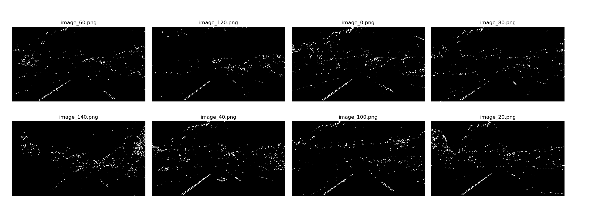

## Advanced Lane Finding Project

---

The goals / steps of this project are the following:

* Compute the camera calibration matrix and distortion coefficients given a set of chessboard images.
* Apply a distortion correction to raw images.
* Use color transforms, gradients, etc., to create a thresholded binary image.
* Apply a perspective transform to rectify binary image ("birds-eye view").
* Detect lane pixels and fit to find the lane boundary.
* Determine the curvature of the lane and vehicle position with respect to center.
* Warp the detected lane boundaries back onto the original image.
* Output visual display of the lane boundaries and numerical estimation of lane curvature and vehicle position.

## Designed pipeline for test images

---

### Camera Calibration

#### 1. Giving the multiple cheesboard images, I make use of all to firstly calculate the camera matrix and the distortion coefficients. Then, image can be undistorted accordingly. [OpenCV doc](https://docs.opencv.org/3.4.3/dc/dbb/tutorial_py_calibration.html)

I start by preparing "object points", which will be the (x, y, z) coordinates of the chessboard corners in the world. Here I am assuming the chessboard is fixed on the (x, y) plane at z=0, such that the object points are the same for each calibration image.  Thus, `objp` is just a replicated array of coordinates, and `objpoints` will be appended with a copy of it every time I successfully detect all chessboard corners in a test image.  `imgpoints` will be appended with the (x, y) pixel position of each of the corners in the image plane with each successful chessboard detection.  

I then used the output `objpoints` and `imgpoints` to compute the camera calibration and distortion coefficients using the `cv2.calibrateCamera()` function.  I applied this distortion correction to the test image using the `cv2.undistort()` function and obtained this result: 

*Example of image distortion*

### Binary images of roads

#### 2. After undistorting all the test images, in this step I create binary images of roads based on color and gradient thresholding.

Here I make use three thresholding operation:

* Absolute values of gradients along the x direction by Sobel Operation.
* S channel values of images converted into HLS color space.
* Gradient angle values.
  
Since the directions of roads in the view of the vehicle are almost verticle, gradient values along the x direction and gradient angle values can help to threshold road areas. Also, by converting images from RGB to HLS color space, it is more robust to lighting change for color selection than just thresholding in RGB space. 
 
Hereby, the parameters of thresholding for test images are as follows:
`abs_sobel_x_thresh=(20,100)`, `S_thresh=(170,255)`, `dir_angle_sobel_kernel=9, dir_angle_thresh=(0.5,np.pi/2)`.

Based on those, I obtain the following road regions of test images:

*detected road regions*

### Source points finding for perspective transformation

#### 3. In order to get rid of other selected pixels in the binary scene and better calculate curvatures of the roads, I need to do perspective transformation into a "bird eye" view. First, source points should be found in the source images. 

Ideally, I need to select four source points in a trapezoidal shape which will present a rectangle after perspective transformation. I seek to automatically determine those points. So I make use of line detection of last project and use hough transformation to determine a parameterized line representation of lanes and get the corresponding four points according to a predefined region masking.

Here is the examples for automatically selecting source points. The start and end points of the lines are designed as source points.

*source points selection on test images*

### Perspective transformation

#### 4. Destination points can be easily selected, as long as they represent a rectangle. Then, I make use of [OpenCV code](https://docs.opencv.org/3.0-beta/doc/py_tutorials/py_imgproc/py_geometric_transformations/py_geometric_transformations.html?highlight=perspective%20transform) to do the transformation. 

I set the destination points as `np.float32([[300, img.shape[0]], [offset, 0], [img.shape[1]-300, 0], [img.shape[1]-300, img.shape[0]]])
`
Here is the result of transformed test images:

*test images in a perspective view*

### Detection of roads in transformed binary images

#### 5. Accordingly, I can also obtain binary images in the birdeye view. In order to determine the road regions, I make use of the sliding window method inroduced in udacity class. For representing a curved lane, the detected road pixels can be represented by a second order polynomial. The details are described as follow:

* Calculating the historgram by summing the binary values in the bottom half binary image along the y direction.
* Find the peak positions on the left and right, which represent the starting points of roads.
* Within a certain area of sliding window, extracting the coordinates of all active points (binary value = 1) and append to the road coordinate lists. Recalculating the current middle point according to those coordinates inside the sliding window, if the number of active points is larger than a threshold, or stay unchanged.
* After the collection of all sliding windows, a second order polynomial can be fitted by the `(x,y)` coordinates of road points.

Here is the result of polynomial fitting:

*detected road points and polynomial fitting result*

### Curvature calculation 
#### 6. At last, curvature of roads can be easily calculated by mathmatical manipulation. Also, the position of vehicle with respect to lane can be also obtained. In details,

* Take left lane for example, the curvature can be calculated by:
    `left_curverad = (1 + (2 * left_fit_cr[0] * (y_eval*ym_per_pix) + left_fit_cr[1])**2)**(3/2)/(2*abs(left_fit_cr[0]))`, where `left_fit_cr` are the coefficients of second order polynomial and `ym_per_pix` is how many meters are one pixel represent in y direction. It can be set as `30/720`.
* Vehicle offset can be calculated by `car_offset = ((x_left + x_right)/2 - width/2) * xm_per_pix`, where `xm_per_pix` is `3.7/700`, `width` is the width of the whole image.

Here is the result of test images:

*final result of test images*

---
## Modification for videos

---

At first, I would like to test the proposed pipeline on the project and challenge videos, but it does not work on challenge video. I rethink about the shortcomings and improve the method further. 

For the challenge video, the vehicle went under a brodge, where the roads are very dark. It makes the above thresholding method may not extract road areas. Also, since the frequent variation of lightness and color of roads in the challenge video, the source point positions determined by the above automatic method are not consistent in video time-series, since I make use of Hough transform to detect lines first. In that case, the parameters of fitted polynomial also vary accordingly and it makes the fitted line jumping a lot in the challenge video.

To this end, I modify two parts of the above pipeline: 

* Investigate gradient and color thresholding again for the challenge video.
* I resort to a pre-defined fixed source points rather than automatic detection.

#### 1. Thresholding 

By utilizing S channel on the converted HSL image with the threshold `(50,255)`, left yellow line can be extracted in challenge images. 

*Binary map based on S channel thresholding*

By thresholding on L channel on the converted HSL image with the threshold `(160,255)`, white lanes can also be extracted.

*Binary map based on L channel thresholding*

By combining those binary maps based on `|` operation, I can select both yellow and white lines and I term it as `combined_sl`

*Combined binary map based on S and L channels*

However, there are much more information around the roads should be deleted. I then make use of gradient information. 

First, by thresholding on gradient values along x direction with the threshold of `(5,100)`, vertical structures can be largely remained.

*Binary map based on gradient values along x direction*

Then, I try to find some information from gradient angles, by thresholding with the angle range `(0.5,1.3)`, I can get

*Binary map based on gradient angle thresholding*

We can see that most road parts are very bright and almost verticle line in the results of gradient image is thresholded out (image_100, image_140 in the above result).

By combining these two gradient information by `&` operation, I get and term it as `combined_dir_grad_x`

*Combined binary map based on gradient values along x direction and gradient angles*

At the end, I fuse the information of the created two combined image, i.e. `combined_dir_grad_x` and `combined_sl` by using `&`, I get

*Final binary map for road extraction*

As we can see, pixels of left and right lanes can be dominated, while the other parts of the images are suppressed. 

However, we still see that there are almost no detected roads in **image_140**, since the vehicle is under the bridge. I resort to use time-series information for generating the lane lines in this frame. 

#### 2. Fixed source points

The source points and destination points I used for project video and challenge video are:

| Source        | Destination   |  
|:-------------:|:-------------:| 
| 520, 450      | 0, 0          | 
| 730, 450      | 1280, 0       |
| 1127, 720     | 1250, 720     |
| 1250, 720     | 40, 720       |

| Source        | Destination   |  
|:-------------:|:-------------:| 
| 520, 482      | 0, 0          | 
| 800, 482      | 1280, 0       |
| 1250, 720     | 1250, 720     |
| 40, 720       | 40, 720       |

I think these two steps are two main steps for adaptation the method on the challenge video. 

#### 3. Tracking the time-series

Information from single frame cannot be sufficient for creating a stable lane line detection, especially for areas covered by shadow. Making use of time-series information can be helpful to obtain more robust result. 

In the experiment, I mainly track three variables:
* bottom x coordinate of line.
* top x coordinate of line.
* fitted polynomial coefficients of line.

All the current information is created by the averaged values of those variables on e.g. `N=15` frames.

In order to improve the robustness, average operation can be replaced by [trim_mean](https://docs.scipy.org/doc/scipy/reference/generated/scipy.stats.trim_mean.html).

Here are the results of the project and challenge videos:

|Project Video|Challenge Video|
|-------------|-------------|
||

### Discussion

1. Binary mask generation is very important in the whole pipeline, which means that the mask should be robust with respect to color variation of roads and lightness change in the scene. 

2. Optimal source points should be adapted to different cases. Finding how to automatically determine those points is necessary. Also, how to adapt those points based on large curvature variation is also very important. 

3. Confident scores of estimation on each frame can be also intergrated in tracking rather than determing optimal variables based on just simply averaging. 

